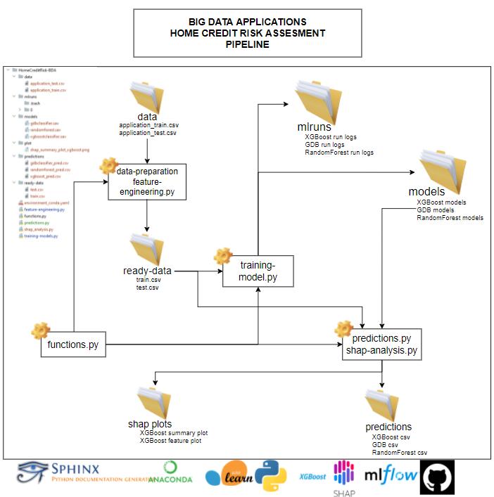
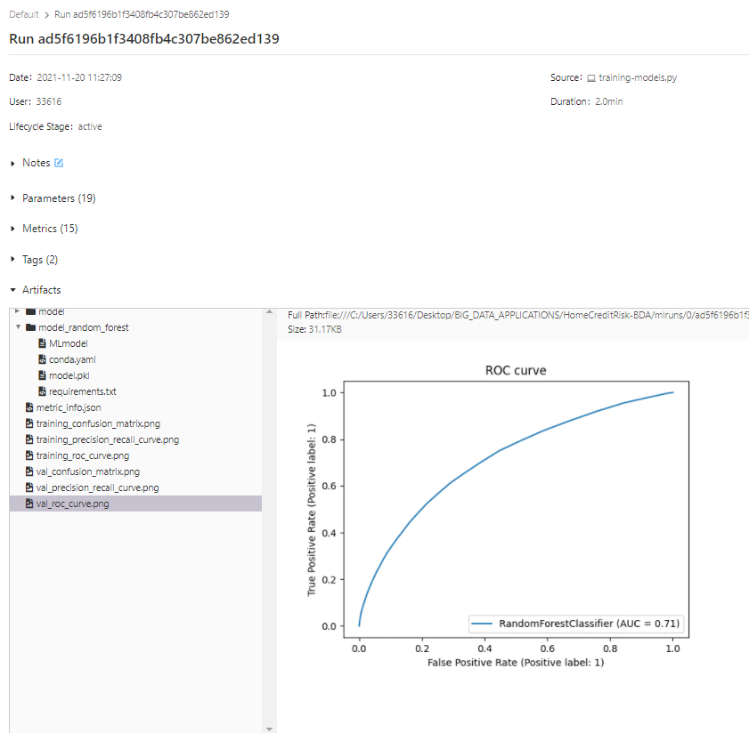
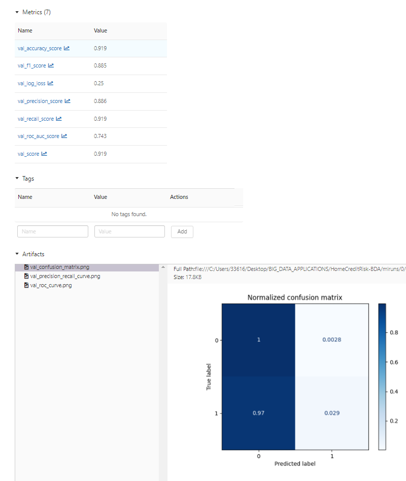
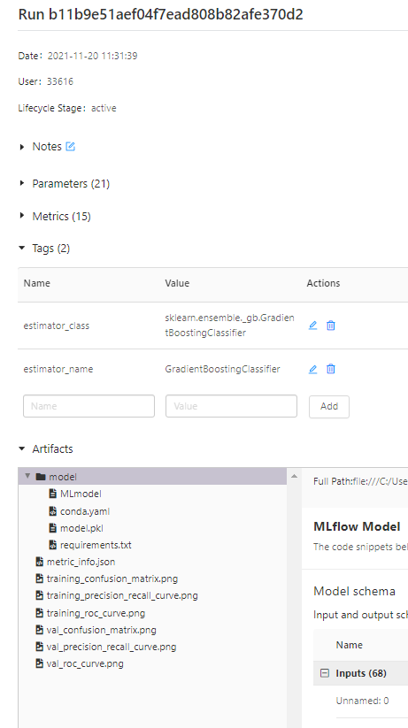
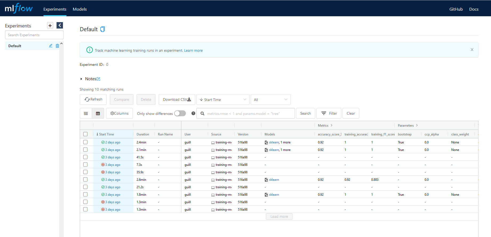
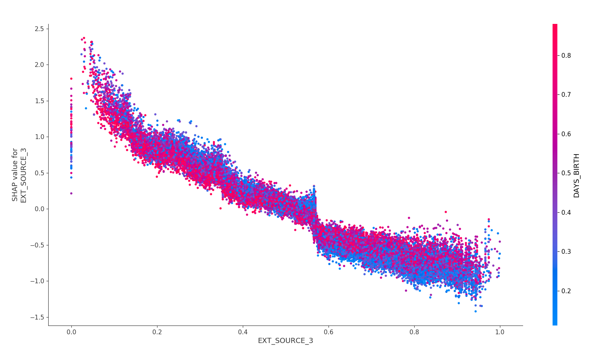
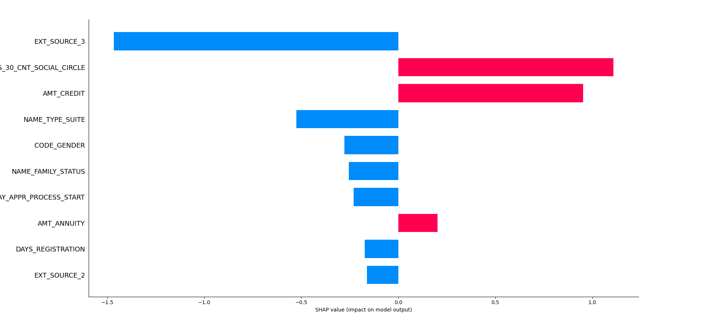
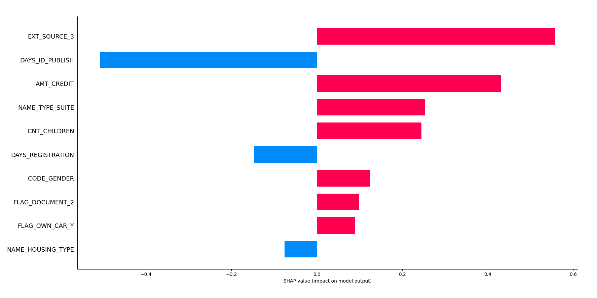
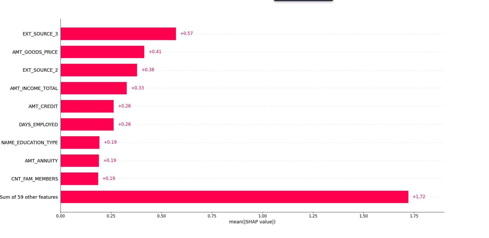
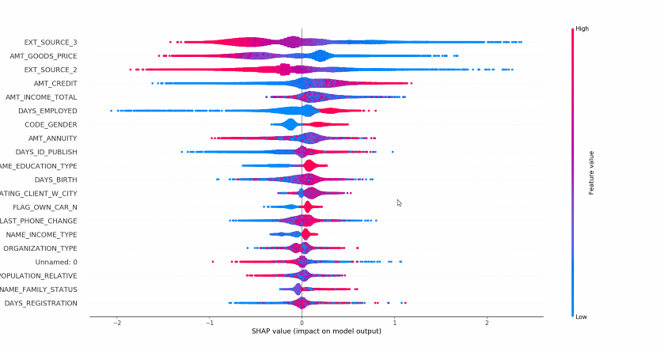

# HomeCreditRisk-BDA
Big Data Applications - HomeCreditRiskAssessment

Project's autor : Hélène Boersma, Quentin Courtois & Guillaume Jaouen

- [Introduction](#introduction)
- [Machine Learning part](#machine-learning-part)
  - [Data preparation / Feature Engineering](#data-preparation-feature-engineering)
  - [Models training](#training-models)
  - [Predictions](#predictions)
  - [Sphinx library](#sphinx-library)
- [MLFlow library part](#mlflow-library-part)
- [SHAP interpretation part](#shap-interpretation-part)
- [Conclusion](#conclusion)

## Introduction

The objective of this project was to make predictions from the Home Credit Risk Classification dataset. The dataset is made up of several csv files. For this project, we focused on application_train.csv on which we built our models, then we made our predictions on application_test.csv. The application_train.csv file is composed of 122 columns, the TARGET column represents whether an applicant is able to repay a loan. The application_test.csv file contains the same columns except TARGET which must be predicted. <br>
Here we made our predictions following 3 different models: Xgboost, Random Forest and Gradient Boosting


<p align="center">
  
</p>

## Machine Learning part

### 1.1  Data preparation / Feature Engineering

For the Data preprocessing part, there were a lot of columns with missing values. We therefore decided to remove the columns containing more than 30% of missing values thanks to the function missing_values (). <br>

```python
def missing_values(df):
   #Functions that return columns with more than 30% of missing values
    total_missing = df.isnull().sum()/df.shape[0] #total missing value of df
    percent_missing = total_missing*100 # putting total_missing as a percentage
    return percent_missing.sort_values(ascending=False).round(1) # return every column that are missing 30% sorted by descending.
```

We also chose to remove all the ‘AMT_REQ_CREDIT_BUREAU_XXX’ columns because it did not seem necessary to make our predictions. <br>

```python
def drop_some_columns(df):
#function that drop following columns that after ur analysis dont seem relevant.
data = df.drop(columns=['AMT_REQ_CREDIT_BUREAU_YEAR',
                            'AMT_REQ_CREDIT_BUREAU_HOUR',
                            'AMT_REQ_CREDIT_BUREAU_DAY',
                            'AMT_REQ_CREDIT_BUREAU_WEEK',
                            'AMT_REQ_CREDIT_BUREAU_MON',
                            'AMT_REQ_CREDIT_BUREAU_QRT']) #dropping those columns in the dataframe df
    return data # return the dataframe.
```
For the columns that contained less than 30% missing values, we replaced the missing values with the means for the numeric values and with a new categorical value for the qualitative values. <br>

```python
def fill_some_rows(df):
#Function to fill rows that are missing value, categorical or numerical.
    data = df #copying dataframe
    data['AMT_GOODS_PRICE'] = data['AMT_GOODS_PRICE'].fillna(data['AMT_GOODS_PRICE'].mean()) # filling with means
    data['NAME_TYPE_SUITE'] = data['NAME_TYPE_SUITE'].fillna("Unaccompanied") # filling with Unacompannied
    data['EXT_SOURCE_2'] = data['EXT_SOURCE_2'].fillna(data['EXT_SOURCE_2'].mean()) # filling with mean
    data['EXT_SOURCE_3'] = data['EXT_SOURCE_3'].fillna(data['EXT_SOURCE_3'].mean()) # filling with mean
    data['OBS_30_CNT_SOCIAL_CIRCLE'] = data['OBS_30_CNT_SOCIAL_CIRCLE'].fillna(data['OBS_30_CNT_SOCIAL_CIRCLE'].mean()) # filling with mean
    data['OBS_60_CNT_SOCIAL_CIRCLE'] = data['OBS_60_CNT_SOCIAL_CIRCLE'].fillna(data['OBS_60_CNT_SOCIAL_CIRCLE'].mean()) # filling with mean
    data['DEF_30_CNT_SOCIAL_CIRCLE'] = data['DEF_30_CNT_SOCIAL_CIRCLE'].fillna(data['DEF_30_CNT_SOCIAL_CIRCLE'].mean()) # filling with mean
    data['DEF_60_CNT_SOCIAL_CIRCLE'] = data['DEF_60_CNT_SOCIAL_CIRCLE'].fillna(data['DEF_60_CNT_SOCIAL_CIRCLE'].mean()) # filling with mean
    data['AMT_ANNUITY'] = data['AMT_ANNUITY'].fillna(data['AMT_ANNUITY'].mean()) # filling with mean
    data['CNT_FAM_MEMBERS'] = data['CNT_FAM_MEMBERS'].fillna(data['CNT_FAM_MEMBERS'].mean()) # filling with mean
    data['DAYS_LAST_PHONE_CHANGE'] = data['DAYS_LAST_PHONE_CHANGE'].fillna(data['DAYS_LAST_PHONE_CHANGE'].mean()) # filling with mean
    return data # return updated dataframe
```

In addition, we made dummies on categorical values. In fact, one-hot encoding allows us to assign binary values to categorical data. Thanks to this, better predictions can be made because one value is not given more weight than another. <br>

```python
def make_categorical_numerical(df):
#Function to make dummies & put categorical as numerical values
    data = df
    data['NAME_HOUSING_TYPE'] = data['NAME_HOUSING_TYPE'].astype('category').cat.codes # category to numerical in same column
    data['NAME_EDUCATION_TYPE'] = data['NAME_EDUCATION_TYPE'].astype('category').cat.codes # category to numerical in same column
    data['NAME_TYPE_SUITE'] = data['NAME_TYPE_SUITE'].astype('category').cat.codes # category to numerical in same column
    data['WEEKDAY_APPR_PROCESS_START'] = data['WEEKDAY_APPR_PROCESS_START'].astype('category').cat.codes # category to numerical in same column
    data['ORGANIZATION_TYPE'] = data['ORGANIZATION_TYPE'].astype('category').cat.codes # category to numerical in same column
    data['CODE_GENDER'] = data['CODE_GENDER'].astype('category').cat.codes # category to numerical in same column
    data['NAME_INCOME_TYPE'] = data['NAME_INCOME_TYPE'].astype('category').cat.codes # category to numerical in same column
    data['NAME_FAMILY_STATUS'] = data['NAME_FAMILY_STATUS'].astype('category').cat.codes # category to numerical in same column
    data = pd.get_dummies(df) # transforming rest of categorical values as dummies
    return data # returning updated dataframe.
```

Finally, we normalize all data with sklearn's MinMaxScaler function. This is to put all the data on the same scale and therefore equalize the weights of each dimension. <br> 
```python
def scale_data(df):
#Function to normalize entire dataset
    min_max_scaler = MinMaxScaler() # using MinMaxScaler of sklearn
    data = df  # copying dataset
    for col in data: # looping through the dataset
        data[[col]] = min_max_scaler.fit_transform(data[[col]]) # applying normalization to each column.
    return data # returning updated dataframe
```

In order to run the preprocessing part, we just need to write in the command line : 
```
   python feature-engineering.py data/application_train.csv train
   python feature-engineering.py data/application_test.csv test
```
The we made a difference between the preprocessing of the train and test csv files because the second one doesn't have the TARGET column. 
After running this two commands, new csv files will be create in the local directory /HomeCreditRisk-BDA/ready-data/. 

### Models training 

To train our model we have selected the TARGET column for Y_train and the rest of the features for X_train. Where our starting data set contained 122 columns, we were able to halve with the preprocessing part and come up with 67 columns.

We have trained 3 different models, the first one corresponds to random forest, the second one to xgboost and the last one to gradient boosting
We started to split the dataset for the training part. 80% of the dataset will be used to train/fit the model and rest 20% will be used to test the model.

```python
X_train, X_test, Y_train,Y_test = train_test_split(X,Y,random_state=42,test_size=0.2)
```

Here an example of how we trained a Random Forest model (it's pretty much the same for gradient boosting and xgboost) :

```python
def train_random_forest(X_train,y_train):
#Function to train a random forest model
    model = RandomForestClassifier(n_estimators=100) #initializing randomforest classifier with n_estimators = 100
    model.fit(X_train,y_train) # fitting data to the model.
    return model # returning created model
```


In order to train a model of our choice, we need to write in the windows command line the name of the python script we want to run, the name of the dataset we choose and the name of the model. 

```
python training-models.py ready-data/train.csv RandomForest
python training-models.py ready-data/train.csv XGBoost
python training-models.py ready-data/train.csv GradientBoostingClassifier
```

### Predictions

```
Accuracy of XGBOOST :  0.919386046209128
Accuracy of rforest :  0.919662455489976
Accuracy of gradient boosting :  0.9198087898151309
```

### Sphinx library

We made our documentation using sphinx library.
From comments in our Code on python files, it generated a documentation

<p align="center">
  
</p>

You can see it in a more summarized way

<p align="center">
  
</p>


## MLFlow library part

Here the learning curve for Random Forest model built on MLFlow.
<p align="center">
  
</p>

Here the confusion matrix for XGBoost model built on MLFlow.
<p align="center">
  
</p>

?????
<p align="center">
  
</p>

Here the history of our runs on MLFlow.
<p align="center">
  
</p>

## SHAP interpretation part

**Build a TreeExplainer and compute Shaplay Values**

```python
shap_values = explainer.shap_values(X)
```

```python
fig2 = shap.dependence_plot("EXT_SOURCE_3", shap_values, X)
plt.savefig('plot/shap_ext_source_3_plot_xgboost.png')
```

<p align="center">
  
</p>

**Visualize explanations for a specific point of your data set**

The first plot is for the class 0, when the loan cannot be repaid.

```python
shap.bar_plot(explainer.shap_values(X)[0],feature_names = list, max_display=10)
```

<p align="center">
  
</p>

The second plot is for the class 1, when the loan can be repaid.

```python
shap.bar_plot(explainer.shap_values(X)[1],feature_names = list, max_display=10)
```
<p align="center">
  
</p>

**Visualize explanations for all points of  your data set at once**

```python
shap.bar_plot(explainer.shap_values(X)[0],feature_names = list, max_display=10)
plt.savefig('plot/test.png')
```
  
<p align="center">
  
</p>

**Visualize a summary plot for each class on the whole dataset**

```python
fig1 = shap.summary_plot(shap_values,X,show=False)
plt.savefig('plot/shap_summary_plot_xgboost.png')
```

<p align="center">
  
</p>

